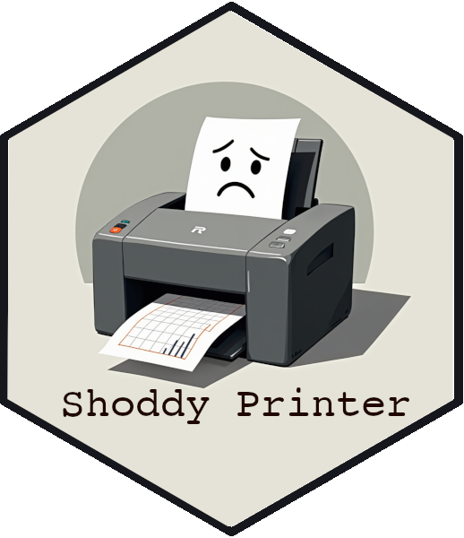

<div style="padding-top:1em; padding-bottom: 0.5em;">

</div>

# shoddyprinter

### The Editor's Shoddy Printer: Simulate How Reviewers and Editors See Your Plots After Printing

[](https://github.com/edubruell/shoddyprinter) [](https://opensource.org/licenses/MIT)

Your carefully crafted `ggplot` looks amazing on your screen, but have you ever considered how it appears to editors and reviewers when they *print out* your paper on that half-broken office printer with the quality of a malfunctioning fax machinefrom the 80s? **The Editor's Shoddy Printer** lets you step into their shoes and view your plots the way they do: washed out, grayscale, blotchy, and barely recognizable.

This package provides you with a simulation of what your pristine visualizations look like when they meet the realities of an underfunded department's printer. **Black-and-white conversion, random artifacts, low contrast?** We’ve got it all. Why wait to be surprised? See your plots through the eyes of your reviewers, *now*.

## Installation

Install the package from GitHub using `devtools`:

```r
# Install the shoddyprinter package
devtools::install_github("edubruell/shoddyprinter")
```

## Why You Need This

-  **View Your Plots Through the Eyes of Reviewers:** Editors and reviewers don’t stare at your plots on a fancy high-res monitor. They print them out, probably in grayscale, and view your findings through fuzzy, low-contrast figures. Simulate that!
- **Preempt Printing Disasters:** Your carefully selected color palette and clean font choices will be meaningless if they’re reduced to smudges and shades of gray. Make sure your plot doesn’t lose all its meaning when printed.
- **Optimize for Real-World Feedback:** Get a realistic view of how your work will actually be experienced and save yourself from those painful reviewer comments about "unclear figures."

## Features

- **Grayscale Conversion:** Convert your vibrant colors into a lifeless grayscale masterpiece.
- **Low-Contrast Text and Legends:** Watch your beautifully chosen fonts and text become barely visible.
- **Random Artifact Lines and Blotches:** Printers are never perfect—your plots shouldn't be either. Add random imperfections to replicate that real printer experience.
- **DPI Reduction:** Your gorgeous high-res plot will soon be reduced to something more reminiscent of a Windows 95-era printout.
- **Dynamic Aspect Ratio:** Automatically calculate the plot size based on your current plot pane, or just default to the classic 16:9 if all else fails.

## Usage
```r
# Load libraries
library(ggplot2)
library(shoddyprinter)

# Create your beautiful ggplot
p <- ggplot2::ggplot(mtcars, ggplot2::aes(mpg, wt)) +
  geom_point(aes(color = factor(gear))) +
  theme_minimal()

# Simulate how the editor's printer will ruin your work
shoddy_printer(p)
```

### Function Details

- `.plot`: The `ggplot` object that's about to be introduced to the realities of a printer’s toner issues.
- `.dpi`: The DPI for the plot (default: 72). Lower DPI simulates the pixelation of your plot in the real world.
- `.width` & `.height`: Plot dimensions in inches. Defaults to 16 by 9 if `dev.size()` doesn’t return anything meaningful.
- `.noise_type`: The type of noise to add to your image (default: "gaussian"). For that genuine, random-print-artifact experience.
- `.file`: Optionally save the final "artwork" to a file for your future despair.
- `.artifact_lines`: If `TRUE`, adds random artifact lines or blotches—just like when you have to replace the printer drum.
- `.bw_artifacts`: If `TRUE` (default), simulates those beautiful black-and-white conversions that erase all the color distinctions you once cared about.
- `.low_contrast`: If `TRUE` (default), makes your text and legends barely readable, *just like in the real world*.

## Example Output

After running the function, here’s what you can expect:

- **Grayscale**: All your beautiful colors reduced to just a few shades of gray.
- **Blurry Text**: Your fonts will look like they've been photocopied 10 times.
- **Random Artifacts**: Blotches and lines you never knew could exist will appear on your plot.
  
## License

This project is licensed under the MIT License. See the [LICENSE](LICENSE) file for details.

## Contributing

Feel like making **shoddyprinter** even worse (or better, depending on your perspective)? Feel free to submit pull requests or issues on [GitHub](https://github.com/edubruell/shoddyprinter/issues).


